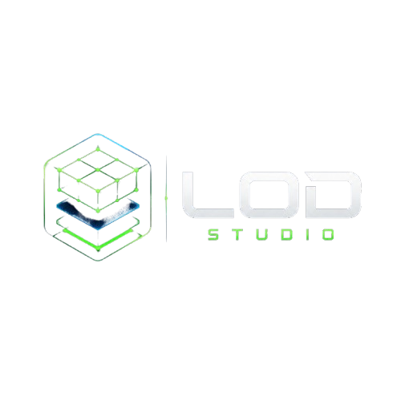
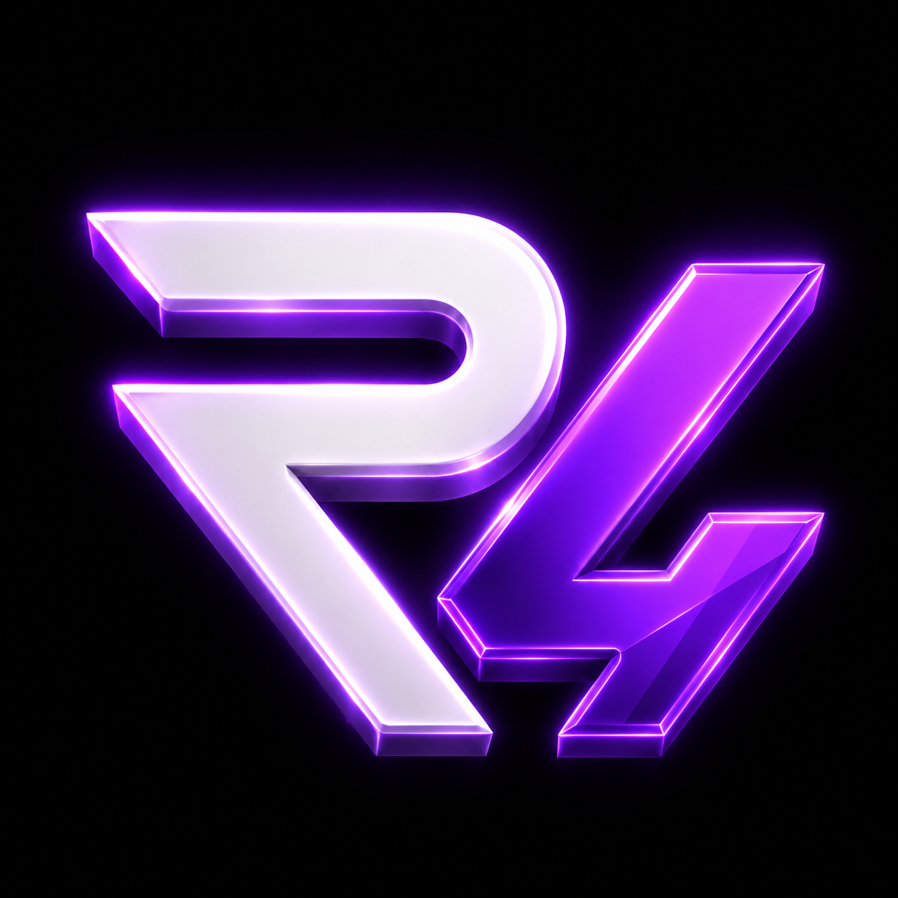

# Hi, I'm Hollows 

## Developer with too many ideas, often turning simple projects into ambitious ones.

### Founder and developer of **Nodify Software**

FiveM developer focused on **tools**, **automation** and **security solutions**.

 

---

## About me

- Founder of **Nodify Software** *(upcoming)*
- Creator of **LOD Studio**
- Building solutions for the **FiveM ecosystem**
- Interested in **automation**, **optimization**, **community management** and **server security**
- Working mainly with **Lua**, **TypeScript**, **Node.js** and **Java**

---

## Featured projects

<table>
<tr>
<td align="center" width="50%">

### [LOD Studio](https://github.com/HigHollows/LOD-Studio)

All-in-one Windows application for creating, previewing and optimizing FiveM resources, including vehicles, textures, clothing and maps.

</td>
<td align="center" width="50%">

### [R4 Discord Bot](https://github.com/HigHollows/R4-Discord-Bot-Community-Management)

Discord community-management bot with moderation, anti-raid protection, tickets, welcome messages, autoroles, giveaways and temporary voice channels.

</td>
</tr>
</table>

---

## Tech stack

---

## Current focus

- Improving **LOD Studio**
- Expanding the **R4 ecosystem**
- Preparing the launch of **Nodify Software**
- Building polished tools for developers and communities

---

## Nodify Software

**Nodify Software** is my upcoming software studio.

The goal is to build useful, reliable and polished products around:

- FiveM development tools
- Resource and asset optimization
- Discord automation
- Community-management systems
- Server-security solutions

> More products, branding and official links will be added soon.

---

### Thanks for visiting my profile

**Building useful software, one project at a time.**

